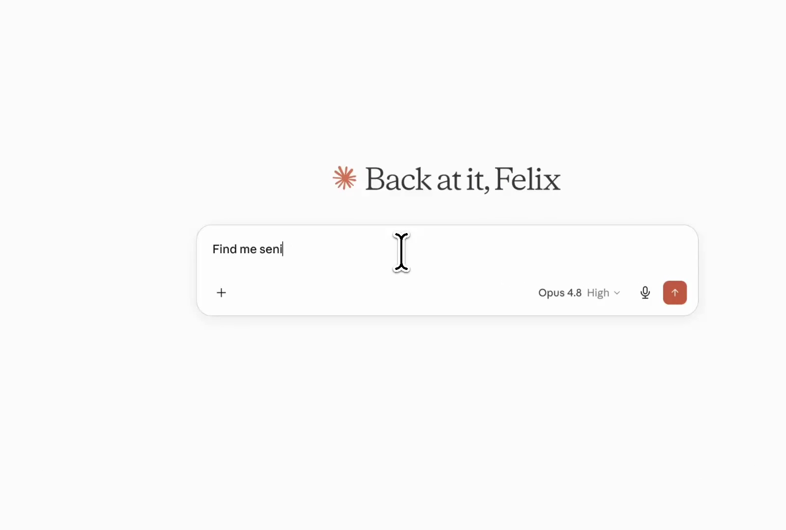

<p align="center">
  
</p>

<h1 align="center">ADPList MCP</h1>

<p align="center">
  Find a mentor, check when they're free, and book a 1:1 — without ever leaving Claude.
</p>

<p align="center">
  <a href="#install"></a>
  <a href="https://adplist.org"></a>
  
</p>

---

## Why this exists

The best career advice you'll ever get is from a person who's already done the thing you're trying to do. The problem is finding them, figuring out when they're free, and actually getting on their calendar — usually across three browser tabs and a week of back-and-forth.

ADPList already solved the hard part: **1M+ people who volunteer their time to mentor others, for free.** Designers, PMs, engineers, founders, and leaders from companies like Google, Stripe, Figma, and Netflix. This connector puts all of them one sentence away inside Claude.

Tell Claude what you're working through — *"I'm a designer trying to break into product"* — and it searches ADPList for the right mentors, shows you who's a fit, finds an open slot, and books the session. The whole loop, in the chat you're already in.

## What you can do

- **Find the right mentor in plain English.** Describe your situation, not keywords — Claude matches you to mentors by role, company, and what you actually need help with.
- **See real availability.** No "let me check my calendar." Claude pulls open slots and helps you pick one.
- **Book and manage sessions.** Request a time, reschedule, or cancel — all from the conversation.
- **Pick up where you left off.** After a session, ADPList writes a summary. Claude can read it back so your next chat starts with context, not a blank page.
- **Mentors run their practice too.** Accept or decline booking requests, reschedule mentees, and see who's on your list — without opening the dashboard.

## See it in action

<p align="center">
  <a href="https://github.com/ADPList/adplist-mcp/blob/main/assets/find-a-mentor-demo.mp4">
    
  </a>
</p>
<p align="center"><a href="https://github.com/ADPList/adplist-mcp/blob/main/assets/find-a-mentor-demo.mp4"><strong>▶ Watch the 20-second demo</strong></a></p>

## Install

You'll need a free [ADPList account](https://adplist.org) (the same email you sign in with). The connector points at the hosted server — there's nothing to run yourself.

**Server URL:** `https://mcp.adplist.org/sse`

### Claude (web & desktop apps)

The easiest way in. Works on Pro, Max, Team, and Enterprise plans.

1. Open **Settings → Connectors**.
2. Click **Add custom connector**.
3. Name it `ADPList` and paste the URL `https://mcp.adplist.org/sse`.
4. Click **Connect** and sign in with your ADPList email (see [Signing in](#signing-in) below).

### Claude Code

```bash
claude mcp add --transport http adplist https://mcp.adplist.org/sse
```

Claude Code picks it up on the next session.

### Claude Desktop (config file)

If your build doesn't show the Connectors UI yet, add it through the config file using the `mcp-remote` bridge:

```json
{
  "mcpServers": {
    "adplist": {
      "command": "npx",
      "args": ["mcp-remote", "https://mcp.adplist.org/sse"]
    }
  }
}
```

## How to use it

Just ask in plain language. You don't have to name any tools — Claude figures out which to use.

- *"find me a product design mentor who's worked at a big tech company"*
- *"I'm switching from marketing to PM — who should I talk to?"*
- *"when is [mentor] free next week? book me the earliest evening slot"*
- *"what sessions do I have coming up?"*
- *"reschedule my Thursday session to next Monday"*
- *"remind me what we covered in my last mentorship session"*

> **Sign in once with your ADPList email.** <a name="signing-in"></a> The first time Claude uses ADPList, it'll open a sign-in step: enter the email tied to your ADPList account and ADPList emails you a one-time code. No password, no separate signup. Don't have an account yet? [Create one free at adplist.org](https://adplist.org) first.

## What's connected

ADPList MCP exposes these tools. You never call them by name — this is just what's under the hood.

**For finding & booking mentorship**

| Tool | What it does |
| --- | --- |
| `search_mentors` | Find mentors by role, company, and what you need help with |
| `get_mentor_profile` | Pull a mentor's public profile and background |
| `list_availability` | See a mentor's open time slots |
| `book_session` | Request a session at a chosen time |
| `list_my_sessions` | See your upcoming and past sessions |
| `cancel_session` | Cancel a session you've booked |
| `manage_my_context` | Save the career context that makes matches smarter |

**Reading back your sessions**

| Tool | What it does |
| --- | --- |
| `list_journals` | List your post-session summaries |
| `read_journal` | Read a specific session summary |

**For mentors**

| Tool | What it does |
| --- | --- |
| `list_mentor_requests` | See incoming booking requests |
| `respond_to_mentor_request` | Accept or decline a request |
| `reschedule_as_mentor` | Move a session to a new time |
| `list_my_mentees` | See who you're mentoring |

## Privacy

You sign in with your own ADPList account, and Claude only ever sees what that account can already see. Sessions you book, context you save, and summaries you read all stay tied to you. ADPList rate-limits requests per account so the connector can't be abused.

## For developers

<details>
<summary>Architecture, configuration, local development, and launch checklist</summary>

<br>

This is a remote MCP server running on Cloudflare Workers. It lets signed-in ADPList users find mentors, manage career context, view availability, request/cancel sessions, and read post-session summaries from supported MCP hosts.

Production URL: `https://mcp.adplist.org/sse`

### Authentication

ADPList MCP uses a Worker-hosted email-OTP OAuth flow:

1. The MCP host opens `https://mcp.adplist.org/oauth/authorize`.
2. The user enters the email tied to their ADPList account.
3. ADPList emails a one-time code via auth-service.
4. The Worker completes MCP OAuth and stores host tokens through `@cloudflare/workers-oauth-provider`.

There is no Cognito hosted UI, Cognito app client, or external OAuth callback to configure.

OAuth discovery is derived from the request host. After custom-domain cutover, verify:

```bash
curl https://mcp.adplist.org/.well-known/oauth-authorization-server
```

The returned issuer and authorization/token/registration endpoints should use `https://mcp.adplist.org`.

### Rate limits

Authenticated MCP tool calls are limited per ADPList `userId` to 60 calls per 10-minute sliding window using the existing `OAUTH_KV` namespace.

When a user exceeds the limit, tools return the existing structured MCP error shape:

```json
{
  "error": {
    "code": "RATE_LIMITED",
    "message": "ADPList is temporarily rate limiting this request.",
    "retryable": true,
    "user_action": "Wait briefly, then retry. If the user is present, explain that ADPList needs a short cooldown."
  }
}
```

### Required Worker configuration

Configured in `wrangler.jsonc`:

- `AUTH_SERVICE_URL` — ADPList auth-service/API base URL for email OTP login
- `SEARCH_SERVICE_URL` — search-service base URL for `search_mentors`
- `MEETINGS_SERVICE_URL` — meetings-service base URL for session and journal tools
- `OAUTH_KV` — KV namespace for OAuth state, OTP throttling, and MCP tool-call rate limits
- `PROFILE_DB` — D1 database for MCP career context
- `MCP_OBJECT` — Durable Object binding for MCP SSE sessions
- `routes` — custom-domain binding for `mcp.adplist.org`

### Development

```bash
npm install
npm run type-check
npm test
npm run deploy
```

`npm run deploy` is guarded and runs `wrangler deploy --dry-run`. Use `npm run deploy:live` only from an approved release/cutover flow.

### Launch smoke checklist

1. Deploy reviewed Worker build.
2. Confirm Cloudflare route/custom domain for `mcp.adplist.org` is active.
3. Verify `https://mcp.adplist.org/health` returns `{ "ok": true }`.
4. Verify OAuth discovery endpoints use `https://mcp.adplist.org`.
5. Install in Claude Desktop and Claude Code using the snippets above.
6. Complete email-OTP sign-in.
7. Run non-destructive tool smoke: `search_mentors`, `manage_my_context` read/merge/clear, `list_availability`, `list_my_sessions`, `list_journals`.
8. Confirm a forced/exhausted limit returns structured `RATE_LIMITED`.

</details>
